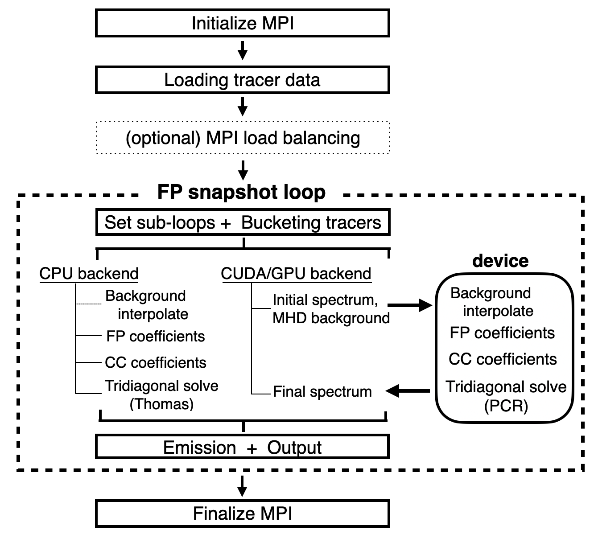
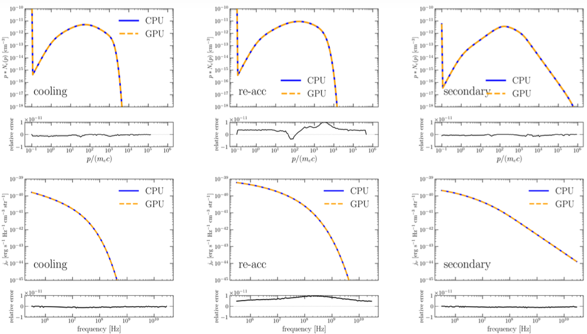

# CROMA: Fokker--Planck cosmic-ray spectral solver for astrophysical simulations

Welcome!

CROMA is a parallel Fokker--Planck (FP) solver for modeling the spectral evolution of cosmic-ray (CR) electrons and protons in post-processing astrophysical simulations.

The code evolves CR spectra along Lagrangian tracer trajectories using background plasma quantities supplied by magnetohydrodynamic (MHD) simulations. It supports both CPU and NVIDIA GPU backends and is designed for large tracer-particle datasets in galaxy clusters and cosmic filaments.

The GPU backend is implemented with CUDA and has been tested on the Leonardo supercomputer at CINECA.






## Features

CROMA includes the following physical processes:

- Coulomb cooling
- Synchrotron, inverse-Compton, and bremsstrahlung losses
- Adiabatic compression and expansion
- Hadronic \(pp\) losses and secondary-particle production
- Stochastic reacceleration (Fermi II), including ASA and TTD models
- Diffusive shock acceleration (Fermi I)

The code can output:

- CR electron and proton spectra
- Synchrotron emissivity
- Inverse-Compton emission
- Hadronic gamma-ray emission
- Hadronic neutrino emission

Parallel execution is supported through:

- MPI + OpenMP on CPUs
- MPI + CUDA on NVIDIA GPUs

## Requirements

The CPU backend requires:

- C compiler
- MPI
- OpenMP
- HDF5
- GSL

The CUDA backend additionally requires:

- NVIDIA CUDA Toolkit
- A CUDA-capable NVIDIA GPU

## Building CROMA

Source files are located in `src/`, and header files are located in `include/`.

The Makefile can be configured through standard Make variables or through an optional local configuration file:

```text
config_local.mk
```

This file can be used to specify machine-dependent compiler, library, and CUDA settings without modifying the main Makefile.

### CPU backend

The default Make target builds the CPU executable:

```bash
make
```

or equivalently:

```bash
make croma.out
```

The resulting executable is:

```text
croma.out
```

### CUDA backend

To build the CUDA executable:

```bash
make croma_cuda
```

The resulting executable is:

```text
croma_cuda
```

Machine-dependent compiler, library, and CUDA settings can be specified in `config_local.mk` or overridden through Make variables.

### Cleaning the build

```bash
make clean
```

## Input data

CROMA primarily operates on tracer-particle histories extracted from MHD simulations.

For HDF5 input, each snapshot contains one row per tracer and includes quantities such as

```text
tracer_dump_NNNN.h5
├── density, temperature, B_x/y/z   [N_tracers]
├── div_v, curl_v_mag               [N_tracers]
├── dx_phys, M_tracer               [N_tracers]
└── Redshift                        scalar
```

The code also provides a synthetic-input mode for testing without tracer HDF5 files.

The input mode is selected in the parameter file:

```text
input_mode = hdf5
```

or

```text
input_mode = synthetic
```

## Running CROMA

A parameter file is supplied as the first command-line argument.

### CPU

For example, using four MPI ranks:

```bash
mpirun -np 4 ./croma.out params.txt
```

### CUDA

For example, using four MPI ranks / GPUs:

```bash
mpirun -np 4 ./croma_cuda params.txt
```

For the CUDA backend, the intended production configuration is one MPI rank per GPU.

The backend can also be specified in the parameter file:

```text
backend = auto
```

with the available choices

```text
auto | cpu | cuda
```

## Basic configuration

Some of the main runtime options are summarized below.

### CR populations

The initial CR species are selected with

```text
seed_cr_species = electron_only
```

with the available choices

```text
electron_only | proton_only | electron_proton
```

Secondary electrons can still be produced in proton-seeded calculations through hadronic interactions.

### Stochastic reacceleration

The reacceleration model is selected with

```text
Dpp_mode = asa
```

with the available choices

```text
asa | ttd | direct_tacc | off
```

For a prescribed acceleration time, for example:

```text
Dpp_mode = direct_tacc
t_acc_direct_gyr = 0.3
```

### Magnetic field

The magnetic-field model is selected with

```text
bfield_mode = sim
```

with the available choices

```text
sim | max | dyn
```

### Output mode

The standard science-output mode is

```text
file_output_mode = write
```

Additional modes are available for performance testing and diagnostics:

```text
nowrite | bucketstats | load_estimate
```

## Outputs

Depending on the selected configuration, CROMA produces files containing CR spectra and non-thermal emission.

Typical outputs include:

```text
CRE_coreNN.bin
CRP_coreNN.bin
eSyn_coreNN.bin
eIC_coreNN.bin
eGamma_coreNN.bin
eNu_coreNN.bin
timing_coreNNN.tsv
run_summary.tsv
```

Only outputs enabled in the parameter file are written.

## Parallel execution and load balancing

Tracer particles evolve independently during each local FP update and are distributed across MPI ranks.

CROMA provides cost-based load balancing to reduce workload imbalance caused by variations in the number of FP substeps required by individual tracers.

Large tracer datasets can also be divided into independent job chunks using `job_count` and `job_index`.

More advanced execution modes, including MPI job splitting and diagnostic runs, are intended primarily for large production calculations.


## Developers
Kosuke Nishiwaki, INAF-IRA


